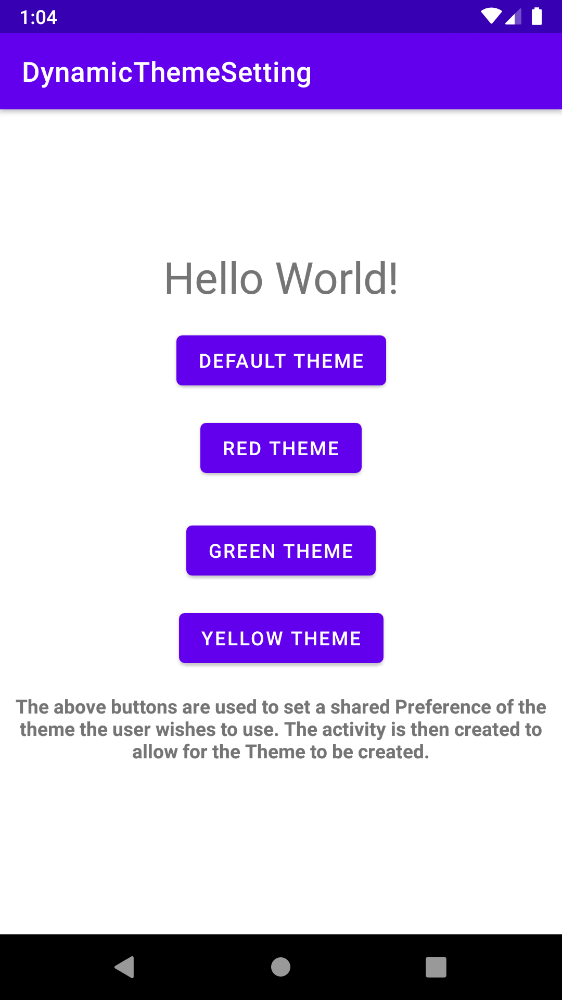
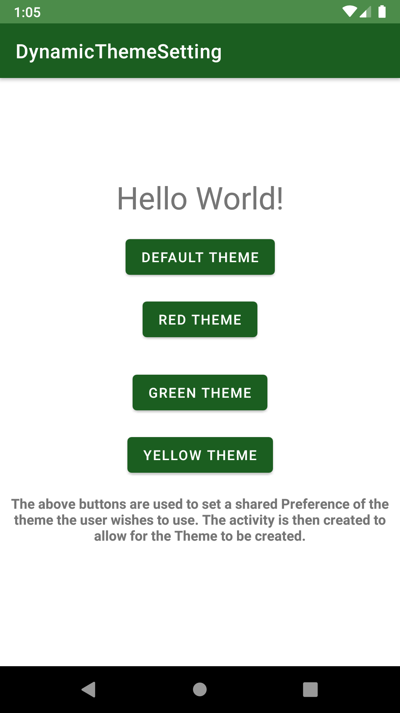
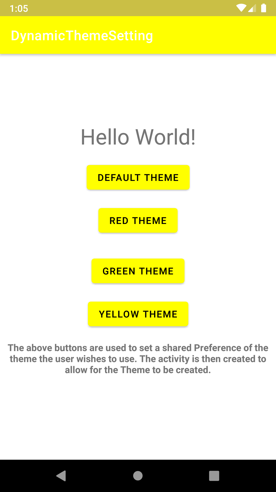

# Dynamic Theming

### Note:

- This particular implementation utilizes SharedPreferences. There are other solutions implementing using Bundle and Intents etc.
- If you wish to change the theme of an already existing activity, call recreate() after setTheme()
- Don't call recreate() if you change theme in onCreate(), to avoid infinite loop.

My Implementation:

`MainActivity:`

```java
public class MainActivity extends AppCompatActivity {

    @Override
    protected void onCreate(Bundle savedInstanceState) {
        super.onCreate(savedInstanceState);
        settingTheme();
        setContentView(R.layout.activity_main);
    }

    public void settingTheme() {
        SharedPreferences pref = PreferenceManager.getDefaultSharedPreferences(this);
        String themeName = pref.getString("prefTheme", "Default");
        if (themeName.equals("Default")) {
            setTheme(R.style.Theme_DynamicThemeSetting);
        } else if (themeName.equals("Red")) {
            setTheme(R.style.RedTheme);
        } else if (themeName.equals("Green")) {
            setTheme(R.style.GreenTheme);
        } else if (themeName.equals("Yellow")) {
            setTheme(R.style.YellowTheme);
        }
    }

    public void setPreference(View view) {
        SharedPreferences pref = PreferenceManager.getDefaultSharedPreferences(this);
        SharedPreferences.Editor editor = pref.edit();
        if (view.getId() == R.id.buttonOriginal){
            editor.putString("prefTheme","Default");
        } else if (view.getId() == R.id.buttonGreen){
            editor.putString("prefTheme","Green");
            editor.apply();
        }else if (view.getId() == R.id.buttonYellow){
            editor.putString("prefTheme","Yellow");
        }
        else if (view.getId() == R.id.buttonRed){
            editor.putString("prefTheme","Red");
        }
        editor.apply();
        settingTheme();
        // Recreating the application
        MainActivity.this.recreate();
    }
}

```

- recreate() only restarts the current activity. Previous activities in the back stack will not have the new theme applied to them.One solution would be to recreate the task stack completely.An example:

```java
TaskStackBuilder.create(getActivity())
            .addNextIntent(new Intent(getActivity(), MainActivity.class))
            .addNextIntent(getActivity().getIntent())
            .startActivities();
```

### Screenshots




.
